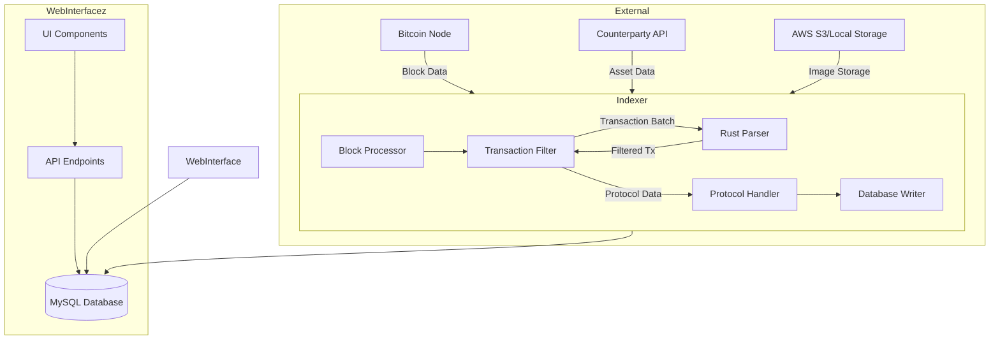

# Bitcoin Stamps Architecture

## System Overview

Bitcoin Stamps is a meta-protocol indexer that processes Bitcoin blockchain data to identify and validate various token formats (Classic Stamps, SRC-20, SRC-721, OLGA, SRC-721r, and SRC-101). The system consists of several key components working together:

## Core Components

### 1. Block Processor (`indexer/src/index_core/blocks.py`)
- Fetches blocks from Bitcoin node
- Manages chain reorganization
- Coordinates processing pipeline
- Handles error recovery

### 2. Transaction Filter (`indexer/src/index_core/block_validation.py`)
- `filter_block_transactions()` orchestrates the transaction filtering process
  (defined in `block_validation.py`, imported and called from `blocks.py`)
- Handles Counterparty issuances and direct Bitcoin transactions
- Coordinates with the Rust parser for efficient filtering
- Prepares filtered protocol data for handlers
- Per-transaction decode is delegated to `transaction_utils.get_tx_info()`

### 3. Rust Parser (`indexer/src/rust_parser/`)
- High-performance transaction parsing (20-50x faster than Python)
- Built as a **PyO3 native extension named `btc_stamps_parser`**
  (`Cargo.toml` / `src/rust_parser/src/lib.rs`, `#[pyo3(name = "btc_stamps_parser")]`)
- Imported into the Python pipeline through the thin wrapper package
  `indexer/src/index_core/fast_parser/` (`from btc_stamps_parser import FastTransactionParser, TransactionInfo`)
- Built with `poetry run task build` (maturin); `index_core` falls back to the pure-Python
  path when the extension is unavailable or `DISABLE_RUST_PARSER` is set
- Memory-efficient LRU caching, pattern matching, and prefix detection

### 4. Backend Injection Seam (`indexer/src/index_core/backend.py`)
- `Backend()` is a singleton over the bitcoind RPC connection
- **`set_backend_override()` / `clear_backend_override()`** and the
  **`BTC_STAMPS_BACKEND_OVERRIDE` env var** (`"module:ClassName"`) let CI and tests inject
  a drop-in backend (e.g. a public-endpoint shim) without a local bitcoind (#800 / #802)
- In production the override is `None` and the real singleton is returned unchanged

### 5. Protocol Handlers
- **Stamp Processor** (`indexer/src/index_core/stamp.py`): Base layer for all protocols
- **SRC-20 Processor** (`indexer/src/index_core/src20.py`): Fungible token handling
- **SRC-721 Processor** (`indexer/src/index_core/src721.py`): Recursive/composite NFT handling
- **SRC-101 Processor** (`indexer/src/index_core/src101.py`): Domain name system

### 6. Database Layer
- `indexer/src/index_core/database.py`: structured MySQL storage, inserts, rollback
  (`purge_block_db()`, `rebuild_balances()`, `rebuild_owners()`, `perform_complete_rollback()`)
- `indexer/src/index_core/database_manager.py`: `ConnectionPool` / `PooledConnection`
  queue-based connection pooling
- Atomic state updates, balance calculation, and ownership tracking

### 7. Reparse / Consensus Validation (`indexer/src/index_core/reparse/`)
- `validator.py`, `snapshot.py`, `db_manager.py` — replays curated blocks and validates
  `txlist_hash` / `ledger_hash` / `messages_hash` against checked-in baselines
- Exposed via taskipy: `poetry run task reparse`, `save-snapshot`, `validate-snapshot`
- Drives the `reparse-validate.yml` CI consensus checks

### 8. Market Data & Caching
- Market-data services: `market_data_service.py`, `market_data_jobs.py`,
  `stamp_market_processor.py`, `src20_market_processor.py`, `source_reliability_service.py`,
  `sales_history_processor.py` — populate the `*_market_data` / `stamp_sales_history` cache
  tables to avoid live external API calls
- Caching layer: `caching.py`, `cache_utils.py`, `cache_types.py`, plus `memory_manager.py`
  and `resource_manager.py` for memory-aware processing
- Background orchestration: `background_coordinator.py`, `background_validator.py`,
  `validation_queue.py`, `reprocessing_queue.py`

### 9. Web Interface at https://github.com/stampchain-io/BTCStampsExplorer
- Deno/Fresh implementation
- REST API for protocol data
- User interface for exploration

## Data Flow

1. **Block Acquisition**: Bitcoin blocks are acquired either through polling or ZMQ notifications
2. **Transaction Filtering**: 
   - Transactions from Counterparty API are processed directly
   - Raw Bitcoin transactions are sent to the Rust parser for efficient filtering
   - The Transaction Filter orchestrates this process and combines results
3. **Protocol Processing**: Filtered transactions are parsed and validated according to protocol rules
4. **Database Storage**: Valid protocol data is stored in the appropriate tables
5. **API Access**: Data is made available through the REST API

## Key Interfaces

### Block Processor → Transaction Filter
- Input: Block data including all transactions
- Output: Filtered list of transactions with protocol-relevant data

### Transaction Filter ⟷ Rust Parser
- Input to Rust Parser: Batches of hex-encoded transaction data
- Output from Rust Parser: Filtered transactions that match stamp protocol patterns
- Note: The Transaction Filter orchestrates this process and handles the results

### Transaction Filter → Protocol Handler
- Input: Filtered and decoded transactions with protocol data
- Output: Validated protocol-specific operations

### Protocol Handler → Database
- Input: Validated protocol operations
- Output: Database records and state updates

## Scalability Design

The system is designed for horizontal scalability:
- Memory-aware processing with configurable limits
- Connection pooling for database operations
- Asynchronous file handling for storage operations
- Batch processing throughout the pipeline

## Error Handling Philosophy

Bitcoin Stamps uses a cascading error handling approach:
1. Validation first - fail early for invalid data
2. Recovery mechanisms for transient errors
3. Graceful degradation for partial failures
4. Database transaction rollback for consistency
5. Block reprocessing for chain reorganizations