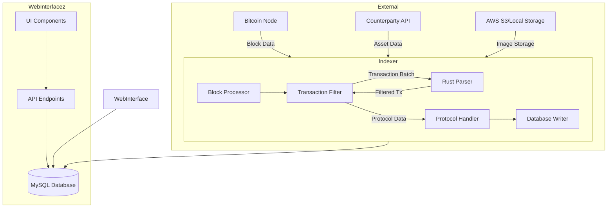

# Bitcoin Stamps Architecture

## System Overview

Bitcoin Stamps is a meta-protocol indexer that processes Bitcoin blockchain data to identify and validate various token formats (Classic Stamps, SRC-20, SRC-721, OLGA, SRC-721r, and SRC-101). The system consists of several key components working together:

## Core Components

### 1. Block Processor (`indexer/src/index_core/blocks.py`)
- Fetches blocks from Bitcoin node
- Manages chain reorganization
- Coordinates processing pipeline
- Handles error recovery

### 2. Transaction Filter (`filter_block_transactions`)
- Orchestrates the transaction filtering process
- Handles Counterparty issuances and direct Bitcoin transactions
- Coordinates with the Rust parser for efficient filtering
- Prepares filtered protocol data for handlers

### 3. Rust Parser (`indexer/src/rust_parser/src/lib.rs`)
- High-performance transaction parsing (20-50x faster than Python)
- Performs the actual filtering of raw Bitcoin transactions
- Memory-efficient caching with LRU implementation
- Pattern matching and prefix detection for stamp protocols

### 4. Protocol Handlers
- **Stamp Processor** (`indexer/src/index_core/stamp.py`): Base layer for all protocols
- **SRC-20 Processor** (`indexer/src/index_core/src20.py`): Fungible token handling
- **SRC-101 Processor** (`indexer/src/index_core/src101.py`): Domain name system

### 5. Database Layer (`indexer/src/index_core/database.py`)
- Structured data storage in MySQL
- Transaction management
- Atomic state updates
- Balance calculation and ownership tracking

### 6. Web Interface at https://github.com/stampchain-io/BTCStampsExplorer
- Deno/Fresh implementation
- REST API for protocol data
- User interface for exploration

## Data Flow

1. **Block Acquisition**: Bitcoin blocks are acquired either through polling or ZMQ notifications
2. **Transaction Filtering**: 
   - Transactions from Counterparty API are processed directly
   - Raw Bitcoin transactions are sent to the Rust parser for efficient filtering
   - The Transaction Filter orchestrates this process and combines results
3. **Protocol Processing**: Filtered transactions are parsed and validated according to protocol rules
4. **Database Storage**: Valid protocol data is stored in the appropriate tables
5. **API Access**: Data is made available through the REST API

## Key Interfaces

### Block Processor → Transaction Filter
- Input: Block data including all transactions
- Output: Filtered list of transactions with protocol-relevant data

### Transaction Filter ⟷ Rust Parser
- Input to Rust Parser: Batches of hex-encoded transaction data
- Output from Rust Parser: Filtered transactions that match stamp protocol patterns
- Note: The Transaction Filter orchestrates this process and handles the results

### Transaction Filter → Protocol Handler
- Input: Filtered and decoded transactions with protocol data
- Output: Validated protocol-specific operations

### Protocol Handler → Database
- Input: Validated protocol operations
- Output: Database records and state updates

## Scalability Design

The system is designed for horizontal scalability:
- Memory-aware processing with configurable limits
- Connection pooling for database operations
- Asynchronous file handling for storage operations
- Batch processing throughout the pipeline

## Error Handling Philosophy

Bitcoin Stamps uses a cascading error handling approach:
1. Validation first - fail early for invalid data
2. Recovery mechanisms for transient errors
3. Graceful degradation for partial failures
4. Database transaction rollback for consistency
5. Block reprocessing for chain reorganizations