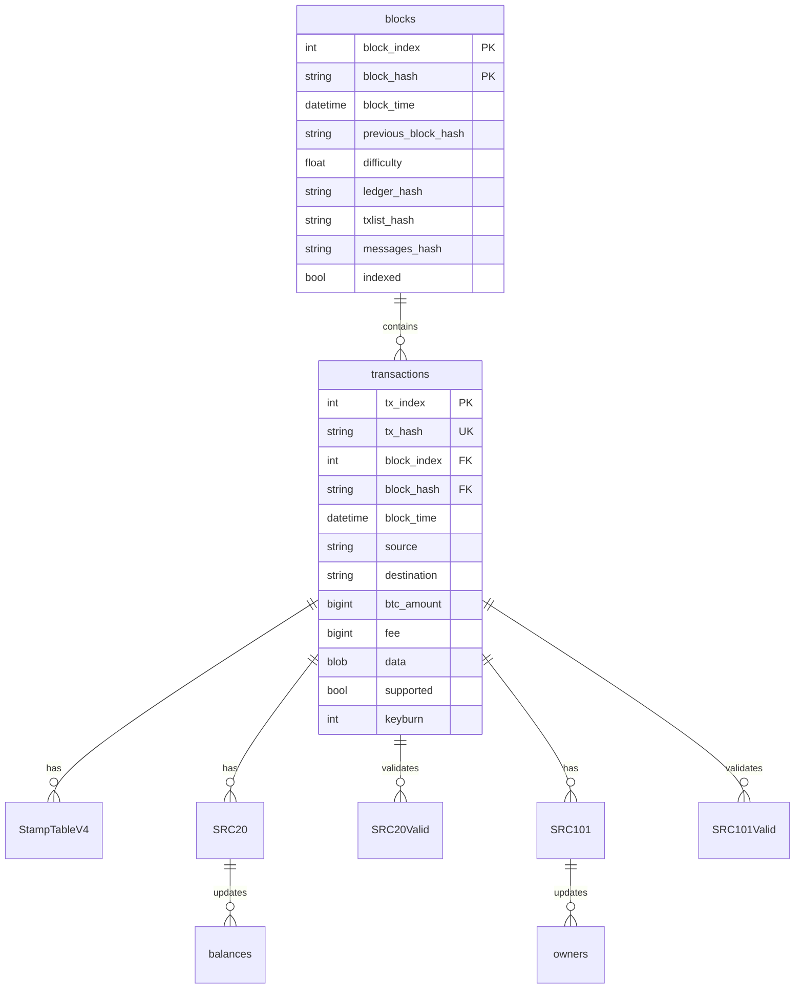

# Bitcoin Stamps Database Reference

This document provides comprehensive information about the Bitcoin Stamps database schema, relationships, and operations.

## Schema Overview

The Bitcoin Stamps database is designed to efficiently store and retrieve protocol data with a focus on:

1. **Transaction-based structure**: Each protocol entity is linked to Bitcoin transactions
2. **Hierarchical organization**: Protocol-specific tables build upon core transaction data
3. **Balance tracking**: Efficient token balance and ownership management
4. **Consistency enforcement**: Foreign key relationships maintain data integrity

## Tables Diagram



## Full Table Inventory

The schema is defined in [`indexer/table_schema.sql`](../indexer/table_schema.sql) and
currently contains **30 tables**. The list below is generated from that file (every
`CREATE TABLE`), with a one-line purpose each. Detailed column references for the most
important tables follow in the next sections.

| # | Table | Purpose |
|---|-------|---------|
| 1 | `blocks` | Bitcoin block headers plus consensus hashes (`ledger_hash` / `txlist_hash` / `messages_hash`) and `indexed` flag |
| 2 | `transactions` | All processed transactions: source/destination, data payload, fee, `keyburn`, `fee_rate_sat_vb` |
| 3 | `StampTableV4` | Canonical stamp records — image data, mimetype, cpid, creator, supply, detected encoding method |
| 4 | `srcbackground` | Background images / fonts used to render SRC-20 tokens (keyed by `tick` / `tick_hash`) |
| 5 | `creator` | Maps a creator `address` to an optional display name |
| 6 | `SRC20` | Raw (unvalidated) SRC-20 operations parsed from transactions |
| 7 | `SRC20Valid` | Validated SRC-20 operations (deploy / mint / transfer) with `status` |
| 8 | `balances` | Current SRC-20 token balances by address + tick |
| 9 | `s3objects` | Tracks stamp files uploaded to S3 storage |
| 10 | `collections` | Stamp collection definitions |
| 11 | `collection_creators` | Maps collections to their creator addresses |
| 12 | `collection_stamps` | Membership: which stamps belong to which collection |
| 13 | `src20_metadata` | Descriptive/off-chain metadata for SRC-20 tokens (description, social links) |
| 14 | `SRC101` | Raw (unvalidated) SRC-101 domain operations |
| 15 | `SRC101Valid` | Validated SRC-101 operations (reg / transfer / renew) with `status` |
| 16 | `owners` | Current SRC-101 domain ownership (`index`, `id`, `p`, `deploy_hash`, owner, expiry) |
| 17 | `recipients` | SRC-101 recipient address records per operation |
| 18 | `src101price` | SRC-101 registration pricing by name length per deploy |
| 19 | `src20_token_stats` | Aggregated per-token SRC-20 stats (`total_minted`, `holders_count`) |
| 20 | `stamp_views` | Per-stamp view counters |
| 21 | `stamp_market_data` | Multi-source market-data cache per stamp (floor price, volume, holders) |
| 22 | `stamp_holder_cache` | Cached per-stamp holder details for holder pages |
| 23 | `market_data_sources` | Reliability / performance tracking of external market-data sources |
| 24 | `src20_market_data` | Exchange-based market-data cache for SRC-20 tokens |
| 25 | `collection_market_data` | Collection-level aggregated market data |
| 26 | `stamp_sales_history` | Unified sales history across all stamp transactions |
| 27 | `api_call_log` | Logs external (Counterparty) API calls for health / failure tracking |
| 28 | `sales_history_checkpoints` | Checkpoints enabling incremental sales-history catchup |
| 29 | `node_version_history` | Per-component indexer/node version history (`is_current` flag) |
| 30 | `reorg_events` | Records blockchain reorganization events for observability / debugging |

Tables 21–30 implement the market-data cache and operational/observability layers
documented in [MARKET_DATA_CACHE_TABLES.md](./MARKET_DATA_CACHE_TABLES.md).

## Core Tables

### `blocks`

Stores Bitcoin block information with protocol-specific hash data.

| Column | Type | Description |
|--------|------|-------------|
| `block_index` | INT | Block height (Primary Key) |
| `block_hash` | VARCHAR(64) | Block hash (Primary Key) |
| `block_time` | DATETIME | Block timestamp |
| `previous_block_hash` | VARCHAR(64) | Previous block hash (Unique) |
| `difficulty` | FLOAT | Block difficulty |
| `ledger_hash` | VARCHAR(64) | Hash of the current ledger state |
| `txlist_hash` | VARCHAR(64) | Hash of all transactions in the block |
| `messages_hash` | VARCHAR(64) | Hash of protocol messages |
| `indexed` | TINYINT(1) | Whether the block is fully indexed |

### `transactions`

Stores all processed transactions with relevant metadata.

| Column | Type | Description |
|--------|------|-------------|
| `tx_index` | INT | Transaction index (Primary Key) |
| `tx_hash` | VARCHAR(64) | Transaction hash (Unique) |
| `block_index` | INT | Block height (Foreign Key) |
| `block_hash` | VARCHAR(64) | Block hash (Foreign Key) |
| `block_time` | DATETIME | Transaction timestamp |
| `source` | VARCHAR(64) | Source address |
| `destination` | TEXT | Destination address(es) |
| `btc_amount` | BIGINT | BTC amount in satoshis |
| `fee` | BIGINT | Transaction fee in satoshis |
| `data` | MEDIUMBLOB | Raw transaction data |
| `supported` | BIT | Whether transaction is supported |
| `keyburn` | TINYINT(1) | Keyburn status |

## Protocol Tables

### `StampTableV4`

Stores stamp data including images and protocol information.

| Column | Type | Description |
|--------|------|-------------|
| `stamp` | INT | Stamp ID (Primary Key) |
| `block_index` | INT | Block height |
| `cpid` | VARCHAR(25) | Counterparty asset ID |
| `asset_longname` | VARCHAR(255) | Asset name |
| `creator` | VARCHAR(62) | Creator address |
| `divisible` | TINYINT(1) | Whether the asset is divisible |
| `keyburn` | TINYINT(1) | Keyburn status |
| `locked` | TINYINT(1) | Whether the asset is locked |
| `stamp_base64` | MEDIUMTEXT | Base64-encoded stamp data |
| `stamp_mimetype` | VARCHAR(24) | MIME type |
| `stamp_url` | VARCHAR(106) | URL to the stamp image |
| `supply` | BIGINT UNSIGNED | Token supply |
| `block_time` | DATETIME | Creation timestamp |
| `tx_hash` | VARCHAR(64) | Transaction hash (Foreign Key) |
| `tx_index` | INT | Transaction index (Foreign Key) |
| `src_data` | JSON | Protocol-specific data |
| `ident` | VARCHAR(7) | Protocol identifier |
| `is_btc_stamp` | TINYINT(1) | Whether it's a BTC stamp |
| `is_reissue` | TINYINT(1) | Whether it's a reissue |
| `file_hash` | VARCHAR(255) | Hash of the stamp file |
| `is_valid_base64` | TINYINT(1) | Whether the base64 is valid |

### `SRC20` and `SRC20Valid`

Store SRC-20 token operations and validated token operations.

| Column | Type | Description |
|--------|------|-------------|
| `id` | INT | Operation ID (Primary Key) |
| `block_index` | INT | Block height |
| `tx_hash` | VARCHAR(64) | Transaction hash (Foreign Key) |
| `op` | VARCHAR(10) | Operation type (deploy, mint, transfer) |
| `tick` | VARCHAR(10) | Token ticker |
| `tick_hash` | VARCHAR(64) | Hash of the ticker |
| `max` | DECIMAL | Maximum supply |
| `lim` | DECIMAL | Per-mint limit |
| `amt` | DECIMAL | Operation amount |
| `dec` | INT | Decimal places |
| `block_time` | DATETIME | Operation timestamp |
| `creator` | VARCHAR(64) | Creator address |
| `status` | VARCHAR(255) | Validation status (SRC20Valid only) |

### `balances`

Tracks SRC-20 token balances by address.

| Column | Type | Description |
|--------|------|-------------|
| `id` | INT | Balance ID (Primary Key) |
| `address` | VARCHAR(64) | Bitcoin address |
| `tick` | VARCHAR(10) | Token ticker |
| `tick_hash` | VARCHAR(64) | Hash of the ticker |
| `balance` | DECIMAL | Token balance |
| `updated_at` | DATETIME | Last update timestamp |

### `SRC101` and `SRC101Valid`

Store SRC-101 domain operations and validated domain operations.

| Column | Type | Description |
|--------|------|-------------|
| `id` | INT | Operation ID (Primary Key) |
| `block_index` | INT | Block height |
| `tx_hash` | VARCHAR(64) | Transaction hash (Foreign Key) |
| `op` | VARCHAR(10) | Operation type (reg, transfer, renew) |
| `name` | VARCHAR(63) | Domain name |
| `domain_hash` | VARCHAR(64) | Hash of the domain name |
| `registrar` | VARCHAR(64) | Registrar address |
| `owner` | VARCHAR(64) | Owner address |
| `exp_block` | INT | Expiration block height |
| `status` | VARCHAR(255) | Validation status (SRC101Valid only) |

### `owners`

Tracks current SRC-101 domain/token ownership. (Columns below match
`table_schema.sql`; a `recipients` table holds per-operation recipient records.)

| Column | Type | Description |
|--------|------|-------------|
| `id` | VARCHAR(255) | Ownership record ID (Primary Key) |
| `index` | INT | Ordering index within the deploy |
| `p` | VARCHAR(32) | Protocol identifier |
| `deploy_hash` | VARCHAR(64) | Hash of the SRC-101 deploy |
| `tokenid` | VARCHAR(255) | Domain/token identifier (hex) |
| `tokenid_utf8` | VARCHAR(255) | UTF-8 form of the domain name |
| `preowner` | VARCHAR(64) | Previous owner address |
| `owner` | VARCHAR(64) | Current owner address |
| `prim` | BOOLEAN | Whether this is the owner's primary name |
| `address_btc` / `address_eth` | VARCHAR(255) | Resolver address records |
| `expire_timestamp` | BIGINT UNSIGNED | Expiration (unix timestamp) |
| `last_update` | INT | Block height of last update |

## Indexes

The database uses strategic indexes to optimize common query patterns:

1. **Primary Keys**: Unique identifiers for each record
2. **Foreign Keys**: Maintain referential integrity
3. **Performance Indexes**: Optimize query performance for common access patterns
   - `idx_block_index_time`: Block index and time for temporal queries
   - `idx_tx_index_block_time`: Transaction index and block time
   - `cpid_index`: Counterparty asset ID lookup
   - `ident_index`: Protocol identifier lookup
   - `creator_index`: Creator address lookup

## Common Database Operations

### Reindexing / Rollback

**Do not hand-write rollback SQL.** Rolling back a block range is consensus-sensitive
(balances and domain ownership must be rebuilt deterministically), so it is implemented in
[`indexer/src/index_core/database.py`](../indexer/src/index_core/database.py) and driven
through the `rollback` CLI task:

```shell
cd indexer
poetry run rollback   # tools/rollback_db.py — interactive/target-block rollback
```

The relevant functions in `database.py` are:

| Function | Purpose |
|----------|---------|
| `purge_block_db(db, block_index)` | Delete all rows at/after `block_index` across the block-scoped tables |
| `rebuild_balances(db, block_index=None)` | Recompute SRC-20 `balances` from `SRC20Valid` |
| `rebuild_owners(db, block_index=None)` | Recompute SRC-101 `owners` from `SRC101Valid` |
| `perform_complete_rollback(block_index, force=False)` | Full, atomic rollback orchestration |

For a full re-index from genesis, drop/recreate the schema with `table_schema.sql` and let
the indexer replay from `BLOCK_FIRST_MAINNET` (`CP_STAMP_GENESIS_BLOCK` = 779652).

#### Manual table clear (direct-SQL reindex prep)

When preparing a **manual** reindex directly against the database (rather than via the
`rollback` task), the block-scoped tables can be cleared from a chosen height. Set
`@block_index` to the last block you want to **keep + 1** (i.e. the first block to purge).
Derived tables (`balances`, `owners`) are truncated and rebuilt by the indexer. Prefer the
`rollback` task above for consensus-sensitive rollbacks; use this only for a deliberate
manual reindex:

```sql
SET @block_index = 854359;
SET FOREIGN_KEY_CHECKS = 0;

-- Core tables
DELETE FROM transactions WHERE block_index >= @block_index;
DELETE FROM blocks WHERE block_index >= @block_index;

-- Stamp related
DELETE FROM StampTableV4 WHERE block_index >= @block_index;

-- SRC20 related
DELETE FROM SRC20 WHERE block_index >= @block_index;
DELETE FROM SRC20Valid WHERE block_index >= @block_index;
DELETE FROM balances;  -- Will be rebuilt

-- SRC101 related
DELETE FROM SRC101 WHERE block_index >= @block_index;
DELETE FROM SRC101Valid WHERE block_index >= @block_index;
DELETE FROM src101price WHERE block_index >= @block_index;
DELETE FROM recipients WHERE block_index >= @block_index;
DELETE FROM owners;  -- Will be rebuilt

SET FOREIGN_KEY_CHECKS = 1;
```

### Rebuild Balances / Owners

SRC-20 balances and SRC-101 owners are derived state, recomputed from the `*Valid` tables
by `rebuild_balances(db, block_index=None)` and `rebuild_owners(db, block_index=None)` in
[`indexer/src/index_core/database.py`](../indexer/src/index_core/database.py). Use those
functions (or the `rollback` task above) rather than ad-hoc SQL, so the recomputation stays
consistent with consensus.

### Database Connection Management

Connection pooling is implemented in
[`indexer/src/index_core/database_manager.py`](../indexer/src/index_core/database_manager.py).
The real API is a `queue.Queue`-backed `ConnectionPool` that hands out `PooledConnection`
wrappers (calling `.close()` on a wrapper returns the connection to the pool instead of
closing it):

```python
# indexer/src/index_core/database_manager.py
class ConnectionPool:
    def __init__(self, **kwargs): ...          # min/max connections, timeout
    def get_connection(self) -> PooledConnection: ...   # blocks up to `timeout`, else grows
    def return_connection(self, connection): ...        # validates before reuse
    def get_pool_size(self) -> int: ...
    def close_all(self): ...

class PooledConnection:
    def close(self):                            # returns the conn to the pool
        self.pool.return_connection(self.connection)
    def __enter__(self): ...                     # usable as a context manager
    def __exit__(self, *exc): ...
```

There is **no** `DatabaseManager` class; refer to `ConnectionPool` / `PooledConnection`.

## Performance Considerations

1. **Transaction Batching**: Database operations are batched for efficiency
2. **Connection Pooling**: Connections are reused to reduce overhead
3. **Strategic Indexes**: Indexes are designed for common query patterns
4. **Efficient Balance Updates**: Token balances are updated efficiently using delta tracking

## Consistency Mechanisms

1. **Foreign Key Constraints**: Maintain referential integrity
2. **Transaction Isolation**: Appropriate isolation levels for concurrency
3. **Hash Validation**: Consensus hashes verify ledger state
4. **Atomic Operations**: Critical operations are performed atomically

## Database Monitoring

Monitor these key metrics for database health:

1. **Connection Pool Usage**: Number of active connections
2. **Query Performance**: Slow query log analysis
3. **Index Efficiency**: Index usage statistics
4. **Table Sizes**: Growth of key tables
5. **Lock Contention**: Lock wait timeouts and deadlocks