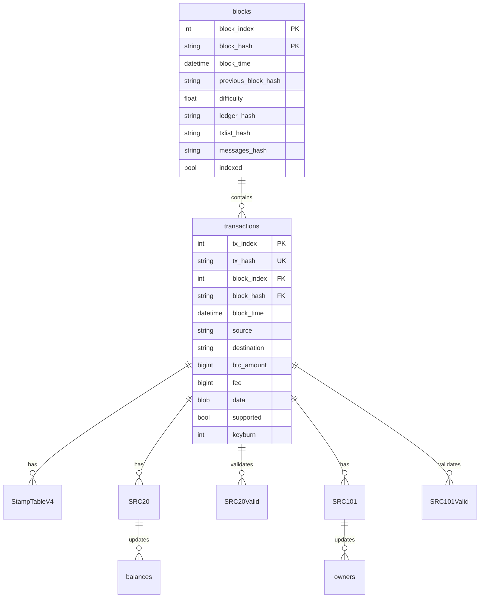

# Bitcoin Stamps Database Reference

This document provides comprehensive information about the Bitcoin Stamps database schema, relationships, and operations.

## Schema Overview

The Bitcoin Stamps database is designed to efficiently store and retrieve protocol data with a focus on:

1. **Transaction-based structure**: Each protocol entity is linked to Bitcoin transactions
2. **Hierarchical organization**: Protocol-specific tables build upon core transaction data
3. **Balance tracking**: Efficient token balance and ownership management
4. **Consistency enforcement**: Foreign key relationships maintain data integrity

## Tables Diagram



## Core Tables

### `blocks`

Stores Bitcoin block information with protocol-specific hash data.

| Column | Type | Description |
|--------|------|-------------|
| `block_index` | INT | Block height (Primary Key) |
| `block_hash` | VARCHAR(64) | Block hash (Primary Key) |
| `block_time` | DATETIME | Block timestamp |
| `previous_block_hash` | VARCHAR(64) | Previous block hash (Unique) |
| `difficulty` | FLOAT | Block difficulty |
| `ledger_hash` | VARCHAR(64) | Hash of the current ledger state |
| `txlist_hash` | VARCHAR(64) | Hash of all transactions in the block |
| `messages_hash` | VARCHAR(64) | Hash of protocol messages |
| `indexed` | TINYINT(1) | Whether the block is fully indexed |

### `transactions`

Stores all processed transactions with relevant metadata.

| Column | Type | Description |
|--------|------|-------------|
| `tx_index` | INT | Transaction index (Primary Key) |
| `tx_hash` | VARCHAR(64) | Transaction hash (Unique) |
| `block_index` | INT | Block height (Foreign Key) |
| `block_hash` | VARCHAR(64) | Block hash (Foreign Key) |
| `block_time` | DATETIME | Transaction timestamp |
| `source` | VARCHAR(64) | Source address |
| `destination` | TEXT | Destination address(es) |
| `btc_amount` | BIGINT | BTC amount in satoshis |
| `fee` | BIGINT | Transaction fee in satoshis |
| `data` | MEDIUMBLOB | Raw transaction data |
| `supported` | BIT | Whether transaction is supported |
| `keyburn` | TINYINT(1) | Keyburn status |

## Protocol Tables

### `StampTableV4`

Stores stamp data including images and protocol information.

| Column | Type | Description |
|--------|------|-------------|
| `stamp` | INT | Stamp ID (Primary Key) |
| `block_index` | INT | Block height |
| `cpid` | VARCHAR(25) | Counterparty asset ID |
| `asset_longname` | VARCHAR(255) | Asset name |
| `creator` | VARCHAR(62) | Creator address |
| `divisible` | TINYINT(1) | Whether the asset is divisible |
| `keyburn` | TINYINT(1) | Keyburn status |
| `locked` | TINYINT(1) | Whether the asset is locked |
| `stamp_base64` | MEDIUMTEXT | Base64-encoded stamp data |
| `stamp_mimetype` | VARCHAR(24) | MIME type |
| `stamp_url` | VARCHAR(106) | URL to the stamp image |
| `supply` | BIGINT UNSIGNED | Token supply |
| `block_time` | DATETIME | Creation timestamp |
| `tx_hash` | VARCHAR(64) | Transaction hash (Foreign Key) |
| `tx_index` | INT | Transaction index (Foreign Key) |
| `src_data` | JSON | Protocol-specific data |
| `ident` | VARCHAR(7) | Protocol identifier |
| `is_btc_stamp` | TINYINT(1) | Whether it's a BTC stamp |
| `is_reissue` | TINYINT(1) | Whether it's a reissue |
| `file_hash` | VARCHAR(255) | Hash of the stamp file |
| `is_valid_base64` | TINYINT(1) | Whether the base64 is valid |

### `SRC20` and `SRC20Valid`

Store SRC-20 token operations and validated token operations.

| Column | Type | Description |
|--------|------|-------------|
| `id` | INT | Operation ID (Primary Key) |
| `block_index` | INT | Block height |
| `tx_hash` | VARCHAR(64) | Transaction hash (Foreign Key) |
| `op` | VARCHAR(10) | Operation type (deploy, mint, transfer) |
| `tick` | VARCHAR(10) | Token ticker |
| `tick_hash` | VARCHAR(64) | Hash of the ticker |
| `max` | DECIMAL | Maximum supply |
| `lim` | DECIMAL | Per-mint limit |
| `amt` | DECIMAL | Operation amount |
| `dec` | INT | Decimal places |
| `block_time` | DATETIME | Operation timestamp |
| `creator` | VARCHAR(64) | Creator address |
| `status` | VARCHAR(255) | Validation status (SRC20Valid only) |

### `balances`

Tracks SRC-20 token balances by address.

| Column | Type | Description |
|--------|------|-------------|
| `id` | INT | Balance ID (Primary Key) |
| `address` | VARCHAR(64) | Bitcoin address |
| `tick` | VARCHAR(10) | Token ticker |
| `tick_hash` | VARCHAR(64) | Hash of the ticker |
| `balance` | DECIMAL | Token balance |
| `updated_at` | DATETIME | Last update timestamp |

### `SRC101` and `SRC101Valid`

Store SRC-101 domain operations and validated domain operations.

| Column | Type | Description |
|--------|------|-------------|
| `id` | INT | Operation ID (Primary Key) |
| `block_index` | INT | Block height |
| `tx_hash` | VARCHAR(64) | Transaction hash (Foreign Key) |
| `op` | VARCHAR(10) | Operation type (reg, transfer, renew) |
| `name` | VARCHAR(63) | Domain name |
| `domain_hash` | VARCHAR(64) | Hash of the domain name |
| `registrar` | VARCHAR(64) | Registrar address |
| `owner` | VARCHAR(64) | Owner address |
| `exp_block` | INT | Expiration block height |
| `status` | VARCHAR(255) | Validation status (SRC101Valid only) |

### `owners`

Tracks current domain ownership.

| Column | Type | Description |
|--------|------|-------------|
| `id` | INT | Ownership ID (Primary Key) |
| `name` | VARCHAR(63) | Domain name (Primary Key) |
| `owner` | VARCHAR(64) | Owner address |
| `exp_block` | INT | Expiration block height |

## Indexes

The database uses strategic indexes to optimize common query patterns:

1. **Primary Keys**: Unique identifiers for each record
2. **Foreign Keys**: Maintain referential integrity
3. **Performance Indexes**: Optimize query performance for common access patterns
   - `idx_block_index_time`: Block index and time for temporal queries
   - `idx_tx_index_block_time`: Transaction index and block time
   - `cpid_index`: Counterparty asset ID lookup
   - `ident_index`: Protocol identifier lookup
   - `creator_index`: Creator address lookup

## Common Database Operations

### Reindexing Blocks

```sql
-- Replace @block_index with the target block
SET @block_index = 850000;
SET FOREIGN_KEY_CHECKS = 0;

-- Core tables
DELETE FROM transactions WHERE block_index >= @block_index;
DELETE FROM blocks WHERE block_index >= @block_index;

-- Stamp related
DELETE FROM StampTableV4 WHERE block_index >= @block_index;

-- SRC-20 related
DELETE FROM SRC20 WHERE block_index >= @block_index;
DELETE FROM SRC20Valid WHERE block_index >= @block_index;
DELETE FROM balances;  -- Will be rebuilt

-- SRC-101 related
DELETE FROM SRC101 WHERE block_index >= @block_index;
DELETE FROM SRC101Valid WHERE block_index >= @block_index;
DELETE FROM owners;  -- Will be rebuilt

SET FOREIGN_KEY_CHECKS = 1;
```

### Rebuild Balances

The `rebuild_balances` function recalculates token balances based on validated operations:

```python
def rebuild_balances(db):
    """Rebuild SRC-20 balances from validated operations."""
    with db.cursor() as cursor:
        # Clear existing balances
        cursor.execute("TRUNCATE TABLE balances")
        
        # Get all valid mint and transfer operations
        cursor.execute("""
            SELECT op, tick, tick_hash, amt, creator, destination, block_index
            FROM SRC20Valid
            WHERE op in ('mint', 'transfer')
            ORDER BY block_index, id
        """)
        
        # Process operations in batches
        batch_size = 1000
        operations = []
        balances = defaultdict(Decimal)
        
        for operation in cursor.fetchall():
            # Process operation and update balances dictionary
            # ...
        
        # Insert updated balances in batches
        insert_query = """
            INSERT INTO balances (address, tick, tick_hash, balance)
            VALUES (%s, %s, %s, %s)
            ON DUPLICATE KEY UPDATE balance = VALUES(balance)
        """
        cursor.executemany(insert_query, balance_records)
        db.commit()
```

### Database Connection Management

The codebase uses a connection pool for efficient database access:

```python
class DatabaseManager:
    def __init__(self, **kwargs):
        self.pool = pymysql.cursors.DictCursor(**kwargs)
        
    def connect(self):
        """Get a connection from the pool."""
        return self.pool.get_connection()
        
    def get_long_running_connection(self):
        """Get a connection for long operations."""
        conn = self.connect()
        conn.ping(reconnect=True)
        return conn
```

## Performance Considerations

1. **Transaction Batching**: Database operations are batched for efficiency
2. **Connection Pooling**: Connections are reused to reduce overhead
3. **Strategic Indexes**: Indexes are designed for common query patterns
4. **Efficient Balance Updates**: Token balances are updated efficiently using delta tracking

## Consistency Mechanisms

1. **Foreign Key Constraints**: Maintain referential integrity
2. **Transaction Isolation**: Appropriate isolation levels for concurrency
3. **Hash Validation**: Consensus hashes verify ledger state
4. **Atomic Operations**: Critical operations are performed atomically

## Database Monitoring

Monitor these key metrics for database health:

1. **Connection Pool Usage**: Number of active connections
2. **Query Performance**: Slow query log analysis
3. **Index Efficiency**: Index usage statistics
4. **Table Sizes**: Growth of key tables
5. **Lock Contention**: Lock wait timeouts and deadlocks