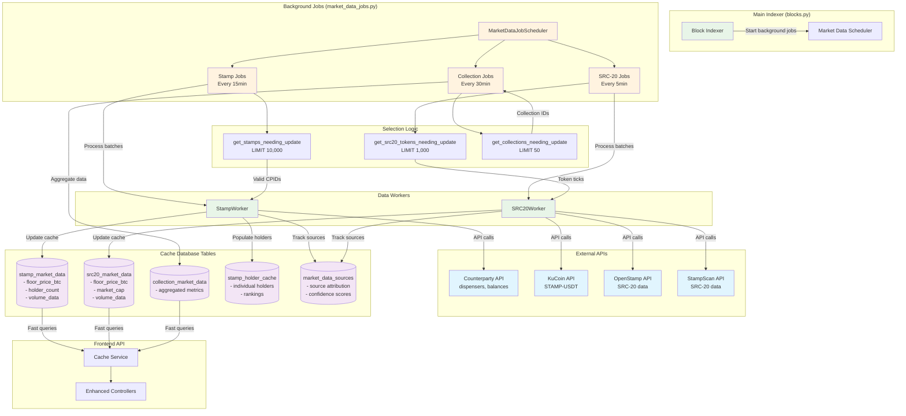

# Market Data Fetching Architecture

This document provides visual diagrams of the market data fetching system implemented in the Bitcoin Stamps indexer.

## System Overview

The market data system consists of background jobs that pre-compute and cache market information for both Bitcoin Stamps and SRC-20 tokens, eliminating the need for real-time API calls during page loads.

## Architecture Diagram

The following diagram shows the complete system architecture including data sources, processing components, and cache tables:

## Key Components

### Main Indexer (`blocks.py`)
- **Block Indexer**: Main blockchain parsing process
- **Market Data Scheduler**: Initializes and manages background market data jobs

### Background Job Scheduler (`market_data_jobs.py`)
- **MarketDataJobScheduler**: Central coordinator for all market data jobs
- **Stamp Jobs**: Process stamp market data every 15 minutes
- **SRC-20 Jobs**: Process SRC-20 token data every 5 minutes  
- **Collection Jobs**: Aggregate collection-level data every 30 minutes

### Data Workers
- **StampWorker**: Processes individual stamp market data from Counterparty API
- **SRC20Worker**: Processes SRC-20 token data from multiple exchange APIs

### External APIs
- **Counterparty API**: Source for dispenser, balance, and send data for stamps
- **KuCoin API**: Exchange data for STAMP-USDT trading pairs
- **OpenStamp API**: SRC-20 token market data and metrics
- **StampScan API**: Additional SRC-20 token information

### Cache Database Tables
- **stamp_market_data**: Floor prices, holder counts, volume metrics for stamps
- **src20_market_data**: Exchange prices, market cap, trading volumes for SRC-20 tokens
- **collection_market_data**: Aggregated collection-level statistics
- **stamp_holder_cache**: Individual holder rankings and percentages
- **market_data_sources**: Source attribution and confidence tracking

## Processing Scale

- **Stamps**: Up to 10,000 stamps processed per 15-minute cycle
- **SRC-20 Tokens**: Up to 1,000 tokens processed per 5-minute cycle
- **Collections**: Up to 50 collections processed per 30-minute cycle
- **Batch Sizes**: 100 stamps or 50 SRC-20 tokens per batch to manage API rate limits

## Performance Benefits

- **Eliminates Real-Time API Calls**: Replaces 40+ concurrent API calls with instant database queries
- **Sub-Second Response Times**: All market data served from optimized cache tables
- **Multi-Source Aggregation**: Combines data from multiple exchanges and sources
- **Intelligent Rate Limiting**: Respects external API limits while maximizing throughput 