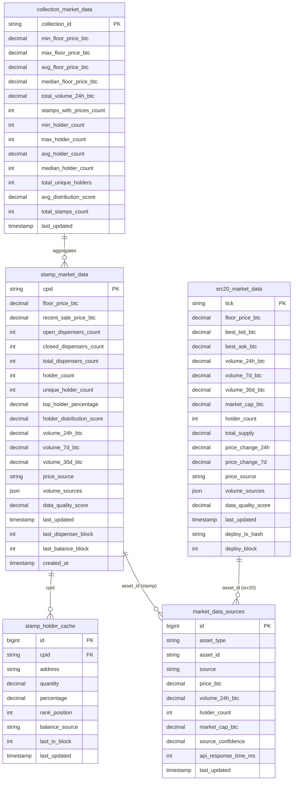

# Market Data Cache Tables

This document describes the database schema for the market data caching system, including table structures, relationships, and indexing strategies.

## Database Schema Overview

The market data cache system uses five main tables to store pre-computed market information for stamps, SRC-20 tokens, collections, and detailed holder data.

## Table Relationships

## Table Specifications

### stamp_market_data
Stores comprehensive market data for Bitcoin Stamps including floor prices, holder metrics, and volume data.

**Key Features:**
- **Floor Price Tracking**: Current and recent sale prices in BTC
- **Dispenser Analytics**: Open, closed, and total dispenser counts
- **Holder Metrics**: Count, distribution, and concentration analysis
- **Volume Data**: 24h, 7d, and 30d volume tracking
- **Multi-Source Attribution**: Source tracking and quality scoring

**Primary Indexes:**
- `cpid` (Primary Key)
- `floor_price_btc` (Performance)
- `holder_count` (Filtering)
- `last_updated` (Maintenance)
- `volume_24h_btc` (Sorting)

### src20_market_data
Stores market data for SRC-20 tokens with multi-exchange aggregation support.

**Key Features:**
- **Exchange Data**: Floor price, bid/ask spreads from multiple sources
- **Market Metrics**: Market cap, supply, and holder analysis
- **Price Changes**: 24h and 7d percentage changes
- **Volume Tracking**: Multi-timeframe volume analysis
- **Source Attribution**: Exchange-specific data tracking

**Primary Indexes:**
- `tick` (Primary Key)
- `floor_price_btc` (Performance)
- `market_cap_btc` (Filtering)
- `volume_24h_btc` (Sorting)
- `price_change_24h` (Trending)

### collection_market_data
Aggregated market data at the collection level for comprehensive collection analytics.

**Key Features:**
- **Price Aggregates**: Min, max, average, and median floor prices
- **Volume Summation**: Total collection volume across timeframes
- **Holder Analytics**: Distribution and concentration metrics
- **Collection Size**: Total stamps and active market participation

**Primary Indexes:**
- `collection_id` (Primary Key)
- `min_floor_price_btc` (Filtering)
- `total_volume_24h_btc` (Sorting)
- `total_unique_holders` (Analytics)

### stamp_holder_cache
Detailed holder information for individual stamps with ranking and percentage data.

**Key Features:**
- **Individual Holdings**: Precise quantity and percentage ownership
- **Ranking System**: Position-based holder rankings
- **Source Attribution**: Balance source tracking (Counterparty, etc.)
- **Transaction Context**: Last transaction block reference

**Primary Indexes:**
- `id` (Primary Key)
- `cpid, address` (Unique constraint)
- `cpid, rank_position` (Ranking queries)
- `cpid, quantity DESC` (Sorting)

### market_data_sources
Multi-source data tracking for transparency and source reliability analysis.

**Key Features:**
- **Source Attribution**: Track data origin and confidence
- **Performance Metrics**: API response time monitoring
- **Data Quality**: Confidence scoring for each source
- **Asset Agnostic**: Supports both stamps and SRC-20 tokens

**Primary Indexes:**
- `id` (Primary Key)
- `asset_type, asset_id, source` (Unique constraint)
- `asset_type, asset_id` (Asset queries)
- `source` (Source analysis)
- `source_confidence` (Quality filtering)

## Data Flow and Relationships

### Stamp Data Flow
1. **StampWorker** fetches data from Counterparty API
2. **stamp_market_data** stores aggregated market metrics
3. **stamp_holder_cache** stores individual holder details
4. **market_data_sources** tracks Counterparty API source data
5. **collection_market_data** aggregates related stamps

### SRC-20 Data Flow
1. **SRC20Worker** fetches from multiple exchange APIs
2. **src20_market_data** stores aggregated multi-source data
3. **market_data_sources** tracks each exchange source separately
4. Source confidence weighting determines final aggregated values

### Collection Aggregation
1. Query all stamps belonging to a collection
2. Calculate statistical aggregates (min, max, avg, median)
3. Sum volume data across all collection stamps
4. Count unique holders across all stamps in collection
5. Store results in **collection_market_data**

## Performance Optimizations

### Query Optimization
- **Covering Indexes**: Include commonly queried columns in indexes
- **Composite Indexes**: Multi-column indexes for complex filtering
- **Partial Indexes**: Filter-specific indexes for performance

### Cache Strategies
- **TTL-Based Updates**: Update frequency based on asset volatility
- **Batch Processing**: Group updates to minimize database load
- **Read Replicas**: Separate read/write workloads for scalability

### Maintenance Operations
- **Cleanup Jobs**: Remove stale data and optimize indexes
- **Statistics Updates**: Keep query planner statistics current
- **Archival**: Move historical data to separate tables

## Data Integrity

### Constraints
- **Foreign Key Relationships**: Ensure referential integrity
- **Check Constraints**: Validate data ranges and formats
- **Unique Constraints**: Prevent duplicate records

### Validation
- **Source Confidence**: 0-10 scale validation
- **Percentage Fields**: 0-100% range validation
- **Price Fields**: Non-negative decimal validation
- **Timestamp Consistency**: Update time validation

## Monitoring and Alerting

### Cache Health Metrics
- **Data Freshness**: Monitor last_updated timestamps
- **Coverage**: Track percentage of assets with current data
- **Source Quality**: Monitor confidence scores and API health
- **Performance**: Track query response times and throughput

### Alerting Thresholds
- **Stale Data**: Alert if data older than 2x update interval
- **Low Coverage**: Alert if <95% of assets have current data
- **Source Failures**: Alert if source confidence drops below threshold
- **Performance**: Alert if query times exceed SLA thresholds 