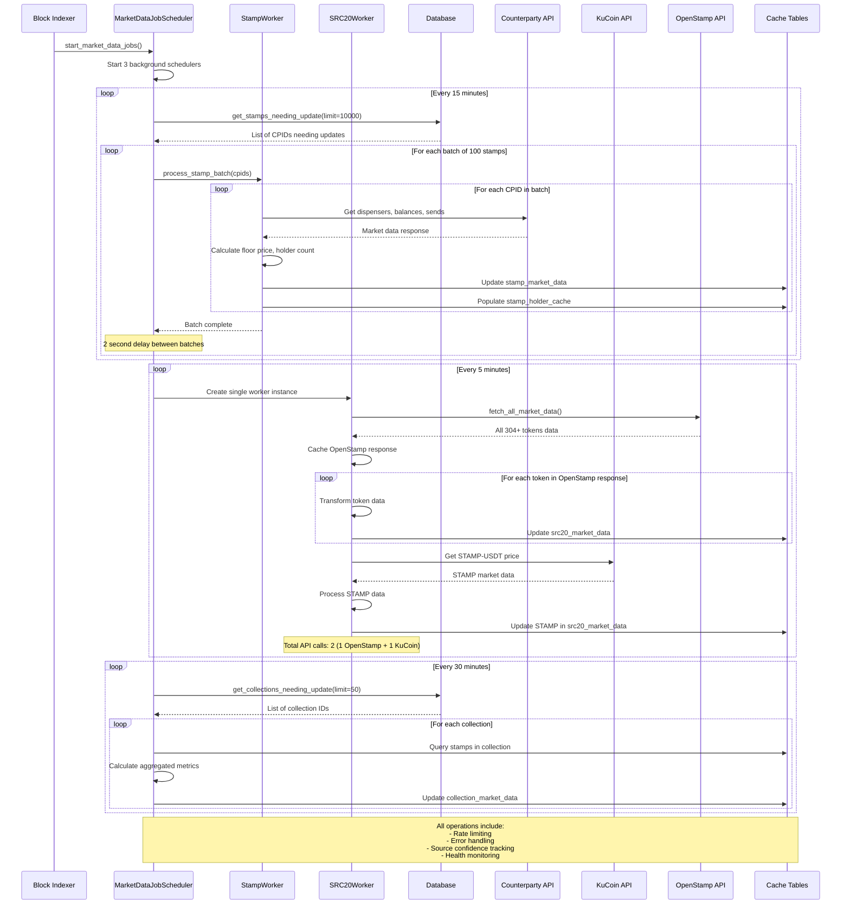

# Market Data Processing Flow

This document details the step-by-step processing flow for market data updates in the Bitcoin Stamps indexer.

## Processing Flow Overview

The market data system uses a time-based scheduling approach with three independent job types running at different intervals. Each job type processes data in batches to manage external API rate limits and ensure system stability.

## Detailed Processing Sequence

The following sequence diagram shows the complete processing flow from initialization through data collection and caching:

## Processing Details

### Initialization Phase
1. **Block Indexer** starts the market data job scheduler during startup
2. **MarketDataJobScheduler** initializes three independent background schedulers
3. Each scheduler runs on its own thread with configurable intervals

### Stamp Market Data Processing (Every 15 minutes)
1. **Selection Query**: Get up to 10,000 stamps needing updates based on last update time
2. **Batch Processing**: Process stamps in batches of 100 to manage API rate limits
3. **Data Fetching**: For each stamp, call Counterparty API to get:
   - Dispenser information
   - Balance data
   - Transaction history
4. **Calculation**: Compute floor prices, holder counts, and volume metrics
5. **Cache Update**: Store results in `stamp_market_data` and `stamp_holder_cache` tables
6. **Rate Limiting**: 2-second delay between batches to respect API limits

### SRC-20 Token Processing (Every 5 minutes)
1. **Single Worker Instance**: Create one SRC20Worker instance to maintain API cache
2. **OpenStamp Bulk Fetch**: Make ONE API call to fetch all 304+ tokens from OpenStamp
3. **Data Processing**: Transform each token's data and update database:
   - Extract token ticker and market data
   - Calculate derived metrics
   - Store in `src20_market_data` table
4. **STAMP Token Update**: Make ONE KuCoin API call specifically for STAMP token
5. **Efficiency**: Only 2 total API calls per 5-minute cycle (vs 1000+ previously)
6. **Cache Management**: OpenStamp response cached for 5 minutes to prevent redundant calls

### Collection Aggregation (Every 30 minutes)
1. **Selection Query**: Get up to 50 collections needing metric updates
2. **Aggregation**: For each collection:
   - Query all stamps in the collection
   - Calculate min/max/average floor prices
   - Compute total volume and holder statistics
   - Generate distribution metrics
3. **Cache Update**: Store aggregated results in `collection_market_data` table

## Error Handling & Recovery

### Rate Limiting
- **Counterparty API**: 2 calls per second maximum
- **KuCoin API**: 0.5 calls per second maximum
- **OpenStamp/StampScan**: 1-2 calls per second maximum

### Error Recovery
- **Transient Errors**: Automatic retry with exponential backoff
- **API Failures**: Graceful degradation with source confidence tracking
- **Database Issues**: Transaction rollback and error logging
- **Network Issues**: Timeout handling and connection retry

### Monitoring
- **Success Rates**: Track completion rates for each data source
- **Processing Times**: Monitor batch processing performance
- **API Health**: Track external API response times and error rates
- **Cache Freshness**: Monitor data staleness and update frequency

## Performance Characteristics

### Processing Scale
- **10,000 stamps** processed every 15 minutes
- **304+ SRC-20 tokens** processed every 5 minutes (all tokens from OpenStamp)
- **50 collections** aggregated every 30 minutes
- **Optimized API usage**: Only 2 API calls for SRC-20 updates (down from 1000+)

### Response Times
- **Cache Queries**: Sub-millisecond response times
- **API Calls**: 200-500ms average response time
- **Batch Processing**: 2-5 minutes per complete cycle
- **End-to-End Latency**: 5-30 minutes maximum data freshness

### Resource Usage
- **Memory**: Efficient batch processing with configurable limits
- **CPU**: Parallel processing with thread pool management
- **Network**: Intelligent rate limiting to prevent API throttling
- **Database**: Optimized indexing for fast cache queries 