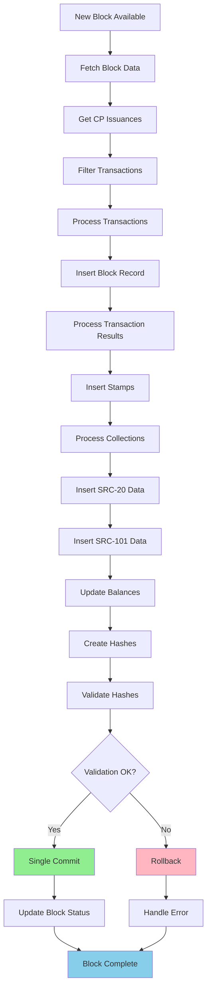
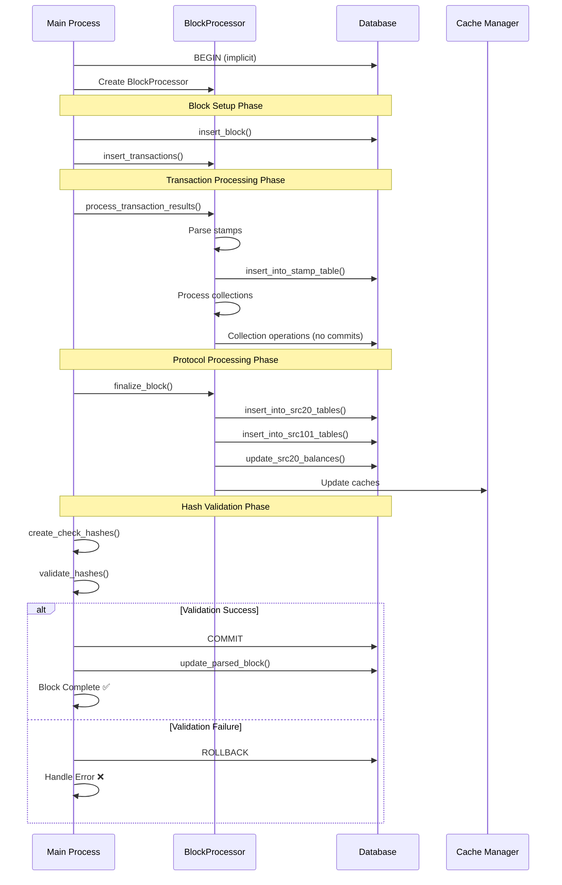
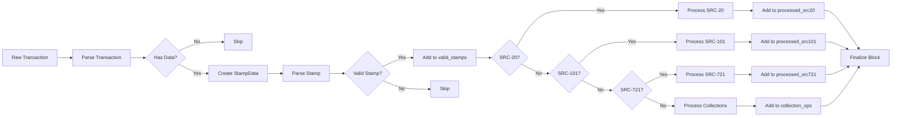

# Bitcoin Stamps Indexer - Block Processing Architecture

## Overview

The Bitcoin Stamps indexer processes Bitcoin blocks sequentially, extracting and validating stamp transactions, SRC-20 tokens, SRC-101 tokens, and other protocol data. This document details the complete block processing architecture, focusing on transaction boundaries, atomic operations, and data flow.

## Core Principles

### 1. Atomic Block Processing
- **Single Transaction Boundary**: Each block is processed as one atomic database transaction
- **All-or-Nothing**: Either the entire block succeeds or everything is rolled back
- **Data Integrity**: No partial states or orphaned data possible

### 2. Sequential Processing
- **Block Order**: Blocks must be processed in sequential order
- **Dependency Management**: Later blocks depend on state from earlier blocks
- **Rollback Support**: Ability to rollback to any previous block for reorgs

### 3. Protocol Support
- **Base Stamps**: Bitcoin Stamps (STAMP protocol)
- **SRC-20**: Fungible tokens on Bitcoin
- **SRC-101**: Domain names and NFTs
- **SRC-721**: NFT collections
- **Collections**: Stamp groupings and metadata

## Block Processing Flow

### High-Level Architecture



### Detailed Transaction Flow



## Transaction Boundary Management

### Single Atomic Transaction

The entire block processing occurs within a single database transaction:

```python
# Implicit transaction start
try:
    # 1. Block setup
    insert_block(db, block_index, block_hash, block_time, previous_block_hash, difficulty)
    
    # 2. Transaction processing
    block_processor = BlockProcessor(db)
    block_processor.insert_transactions(tx_results)
    block_processor.process_transaction_results(tx_results)
    
    # 3. Protocol processing
    (new_ledger_hash, new_txlist_hash, new_messages_hash, 
     stamps_in_block, src20_in_block, src101_in_block) = \
        block_processor.finalize_block(block_index, block_time, txhash_list)
    
    # 4. Hash validation
    if not validate_hashes(new_ledger_hash, expected_hash):
        raise LedgerMismatchError(block_index)
    
    # 5. Single atomic commit
    block_index = commit_and_update_block(db, block_index, block_tip, src20_in_block)
    
except Exception as e:
    # Rollback everything on any error
    db.rollback()
    raise
```

### Database Operations Without Commits

All database operations within the block processing **do not commit individually**:

```python
# ✅ CORRECT: No commits in individual operations
def insert_into_stamp_table(db, parsed_stamps):
    with db.cursor() as cursor:
        cursor.executemany(insert_query, data)
        # No commit here - let caller handle transaction

def insert_into_collections(db, collection_inserts):
    cursor = db.cursor()
    cursor.executemany(query, collection_inserts)
    # No commit here - let caller handle transaction

def insert_into_src20_tables(db, processed_src20_in_block):
    with db.cursor() as src20_cursor:
        insert_into_src20_table_batch(src20_cursor, SRC20_TABLE, src20_batch)
        insert_into_src20_table_batch(src20_cursor, SRC20_VALID_TABLE, src20_valid_batch)
        # No commit here - let caller handle transaction
```

## Component Architecture

### BlockProcessor Class

The `BlockProcessor` manages all block-level operations:

```python
class BlockProcessor:
    def __init__(self, db):
        self.db: Connection = db
        self.valid_stamps_in_block: List[ValidStamp] = []
        self.parsed_stamps: List[StampData] = []
        self.processed_src20_in_block: List[Src20Dict] = []
        self.processed_src101_in_block: List[Src101Dict] = []
        self.collection_operations = []
        self._lock = threading.Lock()

    def process_transaction_results(self, tx_results):
        """Process all transactions and extract protocol data."""
        
    def finalize_block(self, block_index, block_time, txhash_list):
        """Finalize block processing and return hashes."""
```

### Protocol Processing Pipeline



## Database Schema Integration

### Table Insertion Order

The block processing follows a specific order to maintain referential integrity:

1. **blocks** - Block metadata
2. **transactions** - Transaction records
3. **StampTableV4** - Stamp records
4. **collections** - Collection metadata
5. **collection_stamps** - Stamp-collection relationships
6. **collection_creators** - Creator-collection relationships
7. **SRC20** - All SRC-20 transactions
8. **SRC20Valid** - Valid SRC-20 transactions only
9. **SRC101** - All SRC-101 transactions
10. **SRC101Valid** - Valid SRC-101 transactions only
11. **balances** - Updated token balances
12. **owners** - Updated token ownership

### Batch Operations

For performance, the indexer uses batch operations where possible:

```python
# Batch SRC-20 inserts
def insert_into_src20_table_batch(cursor, table_name, batch_data):
    values = []
    for id, src20_dict in batch_data:
        # Prepare row data...
        values.append(tuple(row_values))
    
    # Single batch insert
    cursor.executemany(query, values)

# Batch balance updates
def insert_balances(cursor, all_balances):
    values = [(key, value["tick"], value["address"], value["amt"]) 
              for key, value in all_balances.items()]
    
    BATCH_SIZE = 10000
    for i in range(0, len(values), BATCH_SIZE):
        batch = values[i:i + BATCH_SIZE]
        cursor.executemany(insert_query, batch)
```

## Error Handling and Recovery

### Rollback Scenarios

The indexer handles several error scenarios with automatic rollback:

1. **Database Errors**: Connection issues, constraint violations
2. **Hash Mismatches**: Ledger hash doesn't match expected value
3. **Block Reorgs**: Bitcoin blockchain reorganization
4. **Validation Failures**: Protocol validation errors

### Rollback Implementation

```python
def rollback_to_block(db: Connection, block_index: int, reason: str) -> int:
    """Rollback database to a specific block."""
    clear_all_caches()
    
    tables = [
        SRC20_VALID_TABLE, SRC20_TABLE, SRC101_VALID_TABLE, SRC101_TABLE,
        SRC101_PRICE_TABLE, SRC101_RECIPIENTS_TABLE, STAMP_TABLE,
        TRANSACTIONS_TABLE, BLOCKS_TABLE
    ]
    
    with db.cursor() as cursor:
        for table in tables:
            cursor.execute(f"DELETE FROM {table} WHERE block_index >= %s", (block_index,))
    
    db.commit()
    rebuild_balances(db)
    rebuild_owners(db)
    
    return block_index
```

## Performance Optimizations

### 1. Batch Processing
- **SRC-20 Inserts**: Batch multiple transactions into single SQL operations
- **Balance Updates**: Process balance changes in batches
- **Collection Operations**: Batch collection metadata operations

### 2. Caching Strategy
- **Deploy Cache**: Cache SRC-20 deployment details
- **Balance Cache**: Cache frequently accessed balances
- **Reissue Cache**: Cache stamp reissue checks
- **Block Cache**: Cache block parsing status

### 3. Memory Management
- **Chunk Processing**: Process large datasets in chunks
- **Cache Clearing**: Periodic cache cleanup to prevent memory leaks
- **Connection Pooling**: Reuse database connections efficiently

## Monitoring and Logging

### Block Processing Metrics

```python
def log_block_info(block_index, start_time, stamps_in_block, src20_in_block, src101_in_block):
    """Log comprehensive block processing statistics."""
    
    # Performance metrics
    processing_time = time.time() - start_time
    avg_time = calculate_average_time()
    eta = calculate_eta(block_index, block_tip)
    
    # Progress tracking
    progress = (block_index / block_tip) * 100
    
    # Memory usage
    memory_usage = memory_manager.get_usage()
    
    logger.block_status(
        f"{block_index}/{block_tip} │ {processing_time:.2f}s │ "
        f"Avg: {avg_time} │ ETA: {eta} │ {progress:.1f}% │ "
        f"[S:{stamps_in_block}|20:{src20_in_block}|101:{src101_in_block}]"
    )
```

### Error Tracking

```python
def handle_block_error(block_index, error, attempt):
    """Handle and log block processing errors."""
    
    logger.error(f"Error processing block {block_index} (attempt {attempt}): {error}")
    
    # Categorize error type
    if isinstance(error, LedgerMismatchError):
        handle_ledger_mismatch(block_index)
    elif isinstance(error, mysql.Error):
        handle_database_error(block_index, error)
    elif "Duplicate entry" in str(error):
        handle_duplicate_key_error(block_index)
    else:
        handle_generic_error(block_index, error)
```

## Configuration and Tuning

### Key Configuration Parameters

```python
# Block processing
BTC_SRC20_GENESIS_BLOCK = 796000      # SRC-20 protocol start
BTC_SRC101_GENESIS_BLOCK = 832910     # SRC-101 protocol start
CP_STAMP_GENESIS_BLOCK = 778575       # Stamp protocol start

# Performance tuning
BATCH_SIZE = 5000                     # Transaction batch size
BALANCE_BATCH_SIZE = 10000            # Balance update batch size
COMMIT_INTERVAL = 25                  # Commits per batch operation

# Memory management
MEMORY_THRESHOLD = 0.8                # Memory usage threshold
CACHE_CLEAR_INTERVAL = 100            # Blocks between cache clears

# Error handling
MAX_CONSECUTIVE_ERRORS = 5            # Max errors before cooldown
ERROR_COOLDOWN = 30                   # Seconds to wait after errors
MAX_RETRIES = 3                       # Max retries per operation
```

### Tuning Guidelines

1. **Batch Sizes**: Larger batches improve performance but use more memory
2. **Commit Intervals**: More frequent commits reduce rollback cost but hurt performance
3. **Memory Thresholds**: Lower thresholds prevent OOM but may hurt performance
4. **Cache Settings**: Larger caches improve performance but use more memory

## Testing and Validation

### Unit Testing

```python
def test_block_processing_atomicity():
    """Test that block processing is atomic."""
    
    # Setup test block with intentional error
    block_data = create_test_block_with_error()
    
    # Process block (should fail)
    with pytest.raises(ValidationError):
        process_block(db, block_data)
    
    # Verify no partial data was committed
    assert get_block_count(db) == initial_count
    assert get_transaction_count(db) == initial_tx_count
    assert get_stamp_count(db) == initial_stamp_count

def test_src20_batch_processing():
    """Test SRC-20 batch processing maintains data integrity."""
    
    # Create test SRC-20 transactions
    src20_transactions = create_test_src20_batch()
    
    # Process batch
    insert_into_src20_tables(db, src20_transactions)
    
    # Verify all transactions were inserted correctly
    for tx in src20_transactions:
        assert verify_src20_in_database(db, tx)
```

### Integration Testing

```python
def test_complete_block_processing():
    """Test complete block processing flow."""
    
    # Get real block data
    block_index = 832910
    block_data = fetch_block_data(block_index)
    
    # Process block
    result = process_complete_block(db, block_index, block_data)
    
    # Verify results
    assert result.stamps_in_block >= 0
    assert result.src20_in_block >= 0
    assert result.src101_in_block >= 0
    assert result.ledger_hash is not None
    
    # Verify database state
    assert get_block_by_index(db, block_index) is not None
    assert validate_block_hashes(db, block_index)
```

## Future Enhancements

### 1. Parallel Processing
- **Transaction Parsing**: Parse transactions in parallel
- **Protocol Processing**: Process different protocols concurrently
- **Database Operations**: Parallel batch operations

### 2. Advanced Caching
- **Persistent Caches**: Cache data across restarts
- **Distributed Caching**: Share caches across instances
- **Smart Invalidation**: More intelligent cache invalidation

### 3. Enhanced Monitoring
- **Real-time Metrics**: Live performance dashboards
- **Alerting**: Automated error notifications
- **Profiling**: Detailed performance profiling

### 4. Optimization Opportunities
- **Rust Integration**: Move more processing to Rust
- **Database Optimization**: Better indexing and query optimization
- **Memory Optimization**: More efficient data structures

## Conclusion

The Bitcoin Stamps indexer block processing architecture provides:

- **Atomic Operations**: Guaranteed data consistency
- **High Performance**: Optimized batch processing
- **Robust Error Handling**: Comprehensive rollback and recovery
- **Protocol Support**: Full support for all Stamps protocols
- **Monitoring**: Comprehensive logging and metrics
- **Maintainability**: Clear separation of concerns and modular design

This architecture ensures reliable, performant, and maintainable processing of Bitcoin blocks while maintaining strict data integrity guarantees. 