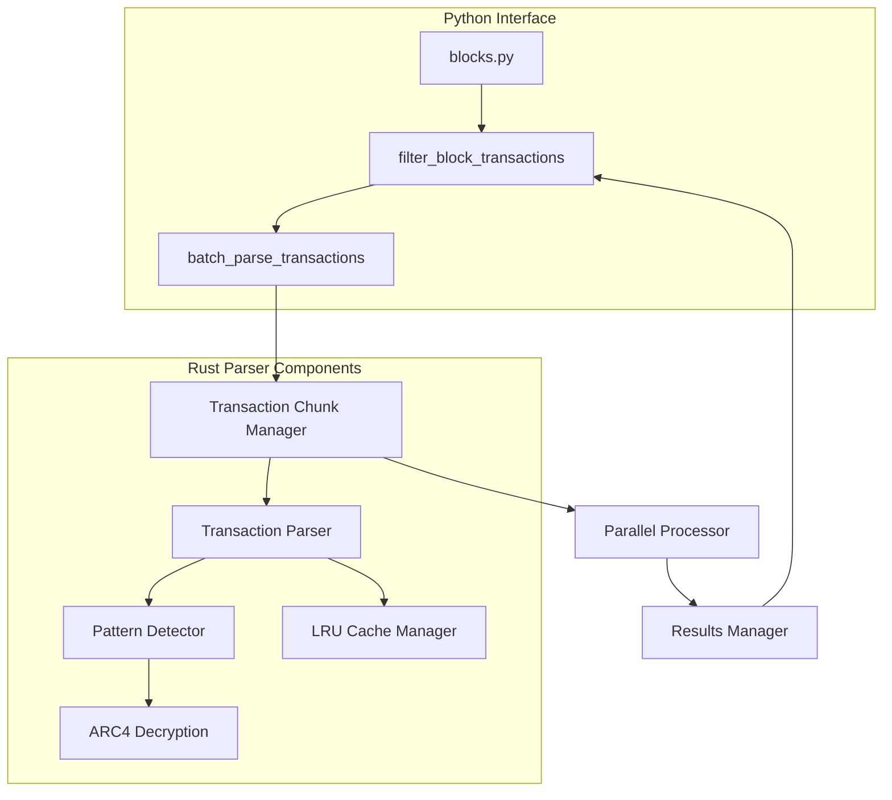

# Bitcoin Stamps Rust Parser

## Overview

The Rust parser is a high-performance transaction processing engine for Bitcoin Stamps. It provides 20-50x faster transaction parsing compared to the Python implementation, enabling efficient processing of large transaction volumes.

## Key Features

- **High-Performance Transaction Processing**: Parse Bitcoin transactions with minimal overhead
- **Memory-Efficient Caching**: LRU cache implementation optimized for transaction data
- **Protocol Detection**: Identify transaction patterns relevant to Bitcoin Stamps protocols
- **Parallel Processing**: Utilize multiple CPU cores via Rayon
- **Python Integration**: Seamless binding through PyO3

## Component Architecture



## Building

The parser needs to be built before use:

```bash
# Development build
cd indexer
poetry run task build-dev

# Production build
poetry run task build
```

## Integration Points

The Rust parser is integrated into the Bitcoin Stamps indexer at the following points:

1. **Transaction Filtering**: `filter_block_transactions()` in `blocks.py` uses the Rust parser to filter relevant transactions
2. **Batch Processing**: `batch_parse_transactions()` method processes transactions in parallel
3. **Protocol Detection**: `process_transaction_chunk()` identifies protocol-relevant data

## Key Classes

### `FastTransactionParser`

The main entry point for transaction parsing, providing:

- `deserialize_transaction()`: Parse a single transaction
- `batch_parse_transactions()`: Process multiple transactions in parallel
- `process_transaction_chunk()`: Handle batches of transactions
- `get_cache_stats()`: Monitor cache performance

### `TransactionInfo`

Represents parsed transaction data with protocol detection flags:

- `has_valid_pattern`: Indicates if the transaction has a protocol-relevant pattern
- `has_valid_data`: Indicates if the transaction contains valid protocol data
- `keyburn`: Indicates if the transaction has a valid keyburn signature
- `should_include`: Final determination if the transaction should be processed

## LRU Cache Design

The parser implements a memory-aware LRU (Least Recently Used) cache to optimize performance:

- Maximum entries: 10,000 transactions
- Memory limit: 100MB
- Thread-safe implementation via Mutex
- Automatic eviction of least recently used items

## Protocol Detection

The parser detects protocol-relevant transactions through pattern matching:

1. **P2WSH Pattern**: 
   - Checks for outputs with script_bytes.len() == 34 && script_bytes[0] == 0x00
   - Used primarily for OLGA format stamps

2. **Multisig Pattern**:
   - Checks for outputs ending with OP_CHECKMULTISIG
   - Used primarily for Classic Stamps and older SRC-20 tokens

3. **PREFIX Detection**:
   - Checks for "stamp:" prefix in decrypted data
   - May appear at different positions (typically position 2 or 4)

## Performance Optimization

The parser is optimized for high-throughput processing:

- **Chunked Processing**: Large batches are divided into chunks of 1000 transactions
- **Parallel Execution**: Each chunk is processed in parallel using Rayon
- **Memory Management**: Cache is cleared when memory usage exceeds thresholds
- **Efficient Deserialization**: Direct binary parsing without intermediate formats

## Exception Handling

The parser implements robust error handling:

- Transaction parsing errors are logged but don't interrupt batch processing
- Memory thresholds prevent out-of-memory conditions
- Invalid transactions are filtered out but reported for analysis

## Examples

### Basic Usage

```rust
// Parse a single transaction
let tx_info = parser.deserialize_transaction(tx_hex)?;
if tx_info.should_include {
    // Process the transaction
}

// Batch process transactions
let results = parser.batch_parse_transactions(tx_hexes)?;
for tx_info in results {
    // All returned results have should_include = true
    process_transaction(tx_info);
}
```

### Debugging

```rust
// Get cache statistics
let stats = parser.get_cache_stats()?;
println!("Cache entries: {}", stats["entries"]);
println!("Memory usage: {}MB", stats["memory_mb"]);

// Debug a specific transaction output
let debug_info = parser.debug_output(txid, output_idx)?;
println!("Script: {}", debug_info["script_pubkey_hex"]);
println!("Has valid data: {}", debug_info["has_valid_data"]);
```